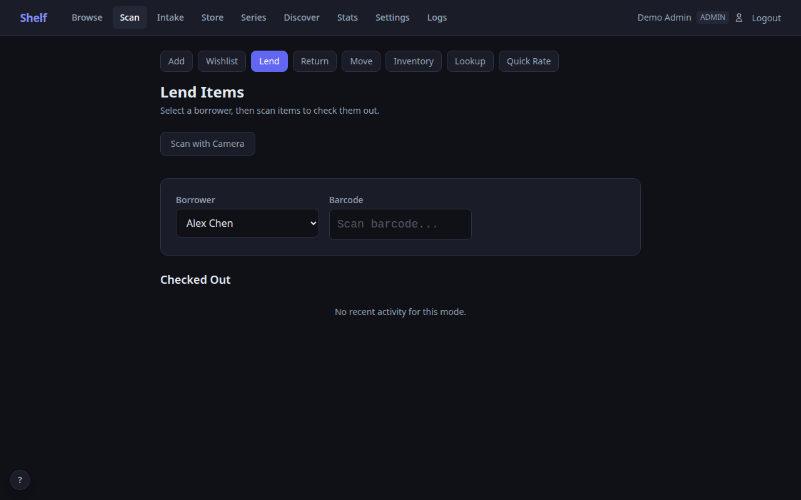

# Shelf

A self-hosted home library catalog with barcode scanning, multi-mode scanning workflows, automatic metadata lookup, cover art, and collection management — all in a single Docker container.

<p align="center">
  
</p>

## Why Shelf?

Most home library apps are cloud-hosted, mobile-only, or require you to manually enter every book. Shelf takes a different approach:

- **Scan and done** — point your phone camera at a barcode or use a USB/Bluetooth barcode scanner and the book is cataloged in seconds, complete with cover art, author, series info, and description. Works out of the box with any scanner that sends Enter after the barcode (most do by default)
- **8 scan modes** — Add, Wishlist, Lend, Return, Move, Inventory, Lookup, and Quick Rate. The scan tab adapts to whatever you're doing: adding new items, lending to a friend, reorganizing shelves, or auditing a room
- **Title search** — don't have a barcode? Search by title across Open Library (books), TMDb (movies), and IGDB (video games) and add directly from results
- **Zero cloud dependency** — runs entirely on your network in a single Docker container with a SQLite database. Your data never leaves your home
- **Works on any device** — responsive web UI that works on phones, tablets, and desktops. No app store required
- **Multi-user** — share with your household. Admins manage the catalog, viewers can browse and track what they're reading
- **More than books** — catalog audiobooks, eBooks, DVDs, CDs, comics, kids' books, and video games. Link physical and digital formats together
- **Video game support** — scan UPC barcodes for modern games or search IGDB by title for retro cartridges (Atari 2600, NES, SNES, etc.). Cover art, publisher, series, and platform tracking with a customizable platform list
- **Lend with confidence** — track who borrowed what with the Lend/Return scan modes and a "Lent Out" filter on the browse page
- **Inventory auditing** — pick a location, scan everything on the shelf, then see what's missing
- **Know what you own** — ISBNdb integration estimates your collection's value for insurance purposes

## Screenshots

| Browse | Scan (Add Mode) |
|--------|-----------------|
|  |  |

| Scan (Lend Mode) | Item Detail |
|-------------------|-------------|
|  |  |

| Stats | Admin Logs |
|-------|------------|
|  |  |

## Quick Start

```bash
docker compose up -d
```

Open `https://localhost:18888` and create your admin account via the setup wizard. That's it.

### Configuration

Create a `.env` file alongside `docker-compose.yml` for host-specific config:

```bash
# Add your machine's IP so you can access Shelf from other devices
CERT_SAN=IP:192.168.1.50,DNS:shelf,DNS:localhost
```

| Variable | Default | Description |
|----------|---------|-------------|
| `CERT_SAN` | `DNS:shelf,DNS:localhost` | TLS certificate Subject Alternative Names |
| `SECRET_KEY` | *(auto-generated)* | JWT signing key (auto-generated and stored in DB if not set) |

### Data

All persistent data lives in `./data/` (bind-mounted into the container):

```
data/
  shelf.db    — SQLite database
  covers/     — cached cover images
  certs/      — auto-generated TLS certificates
```

## Features

### Scanning and Metadata
- **Camera barcode scanning** on mobile — tap to scan ISBNs and UPCs
- **8 scan modes** — Add, Wishlist, Lend, Return, Move, Inventory, Lookup, and Quick Rate
- **Title search** — search Open Library, TMDb, or IGDB by title when you don't have a barcode
- **Cascading metadata lookup** — Open Library, Hardcover, and Google Books
- **Cover art pipeline** — Open Library, Hardcover, Amazon, Google Books, IGDB, and manual upload/search
- **UPC support** — scan DVDs and Blu-rays with TMDb lookup
- **Video game support** — scan UPC barcodes for modern games or search IGDB by title for retro cartridges. Platform tracking with a customizable platform list (30+ platforms from Atari 2600 to PS5)

### Scan Modes

| Mode | What it does |
|------|-------------|
| **Add** | Scan barcodes to add items to your collection with full metadata lookup |
| **Wishlist** | Scan at a bookstore to save items you want — adds as unowned |
| **Lend** | Select a borrower, then scan items to check them out |
| **Return** | Scan items to check them back in |
| **Move** | Select a target location, then batch-scan items to relocate them |
| **Inventory** | Select a location, scan everything there, then check for missing items |
| **Lookup** | Scan to check if an item is in your collection — no changes made |
| **Quick Rate** | Scan to mark items as read/completed |

### Collection Management
- **Filter and search** — by media type, location, reading status, ownership, lending status, and free text
- **Reading tracking** — want-to-read, reading, and read with start/finish dates
- **Locations** — organize by room, shelf, or any system you like
- **Game platforms** — customizable list of platforms, add your own for niche or retro systems
- **Checkout system** — lend to borrowers with the Lend scan mode, filter by "Lent Out" in browse
- **Loan reminders** — overdue loans get a red badge, and an optional daily digest (ntfy or webhook) nags you about them; configure under Settings → Library → Lending
- **Wishlist** — mark items as unowned to build a wish list alongside your catalog
- **Series tracking** — a Series page groups your library by series with position numbers, flags likely gaps, and (with Hardcover configured) checks the full series and adds missing volumes to your wishlist in one click
- **CSV import/export** — bulk operations and backups
- **Goodreads & StoryGraph migration** — upload your library export as-is; the format is auto-detected, reading statuses and owned/wishlist flags are mapped, and covers are fetched automatically
- **Store Mode (offline PWA)** — scan barcodes in a bookstore with no signal and get an instant Owned / On wishlist / Not in library verdict; unknown books queue on-device and are added to your wishlist automatically when you're back online (see [Store Mode](#store-mode-offline-pwa))

### Integrations
- **[Hardcover](https://hardcover.app)** — bidirectional reading status sync, import your library, discover new books
- **[Audiobookshelf](https://www.audiobookshelf.org)** — sync your audiobook library and link physical + digital formats
- **[IGDB](https://www.igdb.com)** — video game metadata, cover art, and platform info via Twitch developer credentials (free)
- **[ISBNdb](https://isbndb.com)** — collection valuation with list prices for insurance documentation

### Store Mode (Offline PWA)

Open **Store** in the nav (or visit `/store`), and Shelf caches your library's
ISBNs on the device. From then on, scanning a barcode answers instantly from
the local cache — even with zero signal in a bookstore basement. Books you
scan that aren't in your library are queued on-device and added to your
wishlist (with metadata and cover) the next time you're online.

To install it as an app, use your browser's "Add to Home Screen" while on the
store page. **One requirement:** service workers (the offline machinery) only
run on an origin your phone trusts. Options, from simplest to cleanest:

1. **Trust the self-signed cert on your phone** — download the cert from your
   Shelf server and install it (Android: Settings → Security → Install a
   certificate → CA certificate; iOS: install the profile, then enable full
   trust under Settings → General → About → Certificate Trust Settings).
2. **VPN home** (WireGuard/OpenVPN/Tailscale) — the offline cache still does
   the work in the store; the VPN is only needed when syncing.
3. **A real certificate** — reverse proxy with Let's Encrypt, or
   `tailscale cert` for a ts.net HTTPS name. Set `SHELF_TRUST_PROXY=1` if a
   proxy sits in front.

Note that `localhost` is always trusted, so store mode works out of the box
for local development.

### Administration
- **Role-based access** — admin, editor, and viewer roles
- **Web log viewer** — monitor auth events, sync activity, and errors from the browser
- **HTTPS** — self-signed TLS certificates generated on first run
- **Backup/restore** — database backup and restore from the settings page

## Tech Stack

| Layer | Technology |
|-------|-----------|
| Backend | Python 3.12, FastAPI, SQLite (WAL mode) |
| Frontend | Jinja2, HTMX, Alpine.js, Tailwind CSS |
| Auth | bcrypt, JWT in HTTP-only secure cookies |
| Container | Docker, non-root user, self-signed HTTPS |

## Roles

| Role | Can do |
|------|--------|
| **Admin** | Everything: settings, users, locations, sync, bulk ops, logs |
| **Editor** | Add/edit/delete items, scan (all modes), manage covers, checkout/checkin, import/export |
| **Viewer** | Browse, search, reading status, export CSV, view stats |

## Metadata Sources

Shelf queries free, public APIs to look up book and game information — no API keys needed for core book functionality:

| Source | What it provides | API key required? |
|--------|-----------------|-------------------|
| [Open Library](https://openlibrary.org) | Title, author, description, cover art, publish info, title search | No |
| [Google Books](https://books.google.com) | Fallback metadata and cover art | No |
| [Amazon Images](https://www.amazon.com) | Fallback cover art via ISBN | No |
| [UPC Item DB](https://www.upcitemdb.com) | Title lookup from UPC barcodes (games, DVDs) | No |

Metadata lookups send only the ISBN or UPC to these services. No personal data, account info, or collection details are transmitted.

## Optional API Keys

Configure in Settings to unlock additional features:

| Service | Enables | Link |
|---------|---------|------|
| **Hardcover** | Reading status sync, richer metadata, import/export, Discover page | [hardcover.app](https://hardcover.app) |
| **IGDB** (Twitch) | Video game metadata, cover art, and platform info | [dev.twitch.tv/console](https://dev.twitch.tv/console) |
| **ISBNdb** | Collection valuation with market prices | [isbndb.com](https://isbndb.com) |
| **TMDb** | DVD/Blu-ray metadata and title search via UPC barcode | [themoviedb.org](https://www.themoviedb.org) |

## Development

```bash
# Rebuild after code changes
docker compose build && docker compose up -d

# View logs
docker compose logs -f shelf

# Access the database
sqlite3 data/shelf.db

# Rebuild the Tailwind stylesheet after changing templates or static/js
# (all JS/CSS is vendored locally — no CDNs; requires node/npx)
make css
```

### QA Pipeline

Shelf ships with a `Makefile` that orchestrates a two-pass local QA workflow — no CI/CD required.

**One-time setup:**

```bash
pip install -r requirements-dev.txt
make install-playwright   # downloads headless Chromium
```

**Common targets:**

| Target | What it does |
|--------|-------------|
| `make test` | Unit and integration tests (pytest, excludes E2E) |
| `make test-e2e` | Playwright E2E browser tests against a live local server |
| `make test-all` | Both of the above |
| `make check-deps` | `pip-audit` vulnerability scan of `requirements.txt` |
| `make check-licenses` | License compliance report |
| `make check-secrets` | Scan tracked files for accidentally hardcoded secrets |
| `make checks` | All three checks above |
| `make report-review` | Code review report via Claude agent |
| `make report-security` | Security audit report via Claude agent |
| `make report-test` | Test coverage audit report via Claude agent |
| `make reports` | All three reports |
| `make qa` | Full Pass 1: `test-all` → `checks` → `reports` |
| `make fix` | Pass 2a: interactive Claude session reads reports and applies fixes |
| `make verify` | Pass 2b: re-run all tests after fixes |
| `make release-check` | Alias for `make qa` |
| `make install-hooks` | Install a pre-push git hook that runs `make test-all` |

**Typical pre-release workflow:**

```bash
make qa          # run tests, checks, and generate reports
# review docs/CODE_REVIEW_*.md, SECURITY_AUDIT_*.md, TEST_AUDIT_*.md
make fix         # Claude reads reports and applies fixes interactively
make verify      # confirm all tests still pass
```

Reports land in `docs/` with today's date (e.g. `docs/CODE_REVIEW_2026-03-27.md`) and are gitignored — they're regenerated each QA cycle.

Report targets default to `claude-sonnet-4-6`. Override with `MODEL=` for a deeper pre-release audit:

```bash
make reports MODEL=claude-opus-4-6
```

## License

Personal project. Source available for reference and self-hosting.
