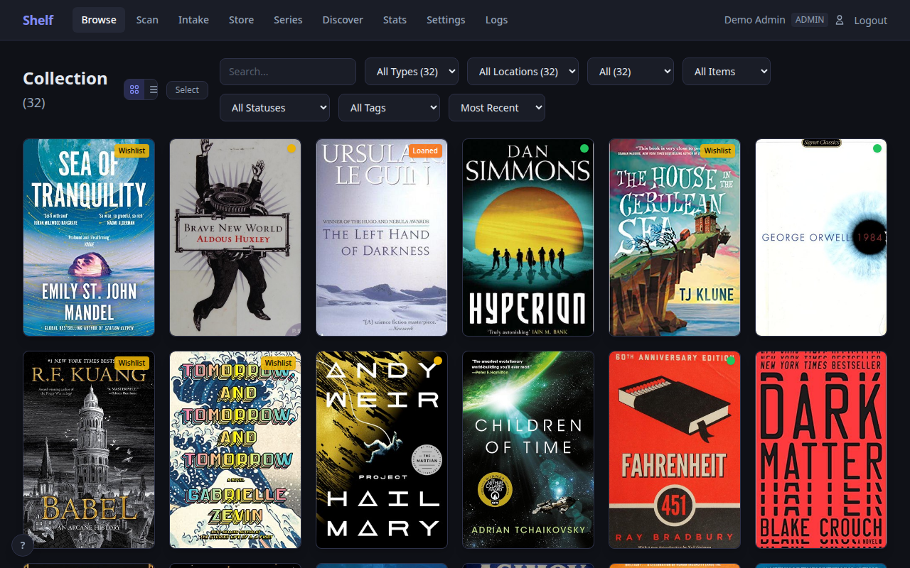
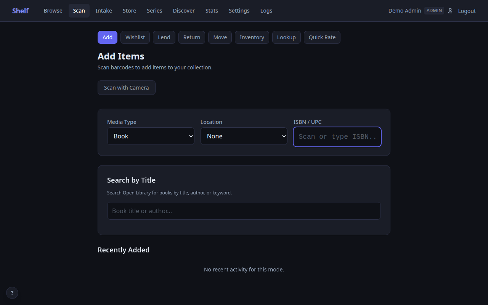
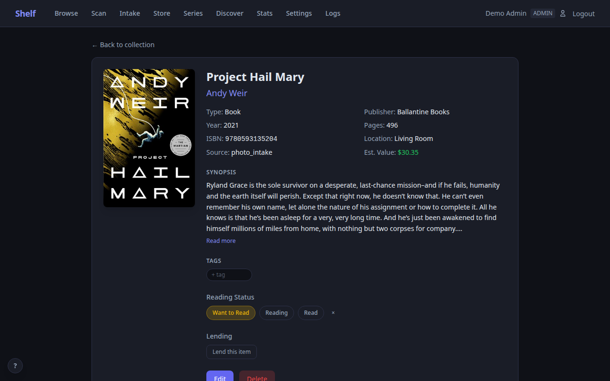
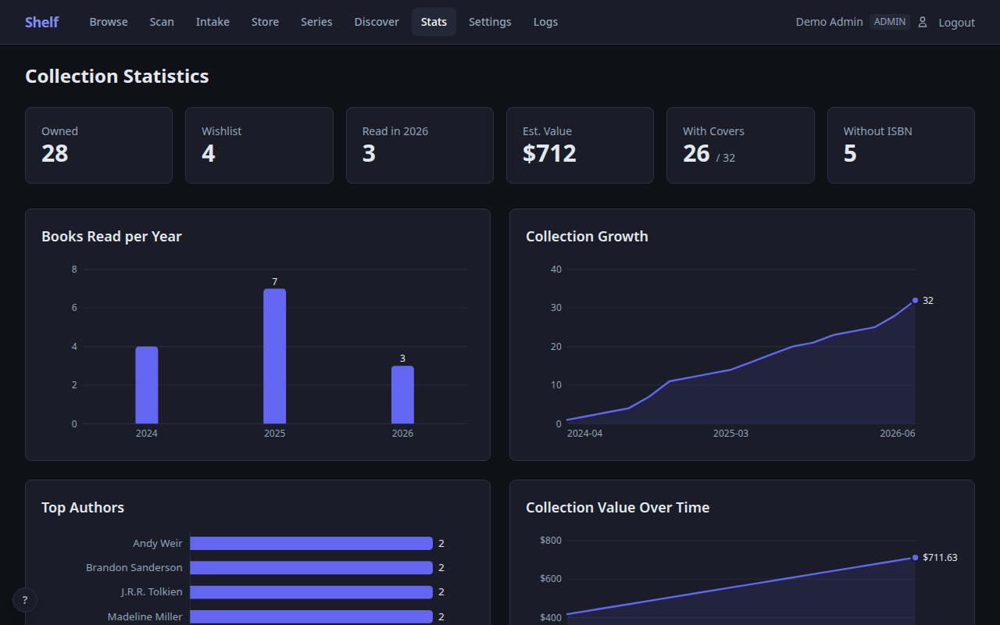
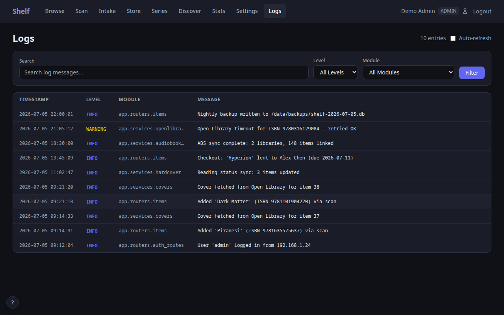

# Shelf

A self-hosted home library catalog with barcode scanning, video game support, automatic metadata lookup, cover art, and collection management — all in a single Docker container.

<p align="center">
  
</p>

## Why Shelf?

Most home library apps are cloud-hosted, mobile-only, or require you to manually enter every book. Shelf takes a different approach:

- **Scan and done** — point your phone camera at a barcode or use a USB/Bluetooth barcode scanner and the book is cataloged in seconds, complete with cover art, author, series info, and description. Works out of the box with any scanner that sends Enter after the barcode (most do by default)
- **Zero cloud dependency** — runs entirely on your network in a single Docker container with a SQLite database. Your data never leaves your home
- **Works on any device** — responsive web UI that works on phones, tablets, and desktops. No app store required
- **Multi-user** — share with your household. Admins manage the catalog, viewers can browse and track what they're reading
- **More than books** — catalog audiobooks, eBooks, DVDs, CDs, comics, kids' books, and video games. Link physical and digital formats together
- **Video game support** — scan UPC barcodes for modern games or search IGDB by title for retro cartridges (Atari 2600, NES, SNES, etc.). Cover art, publisher, series, and platform tracking with a customizable platform list
- **Lend with confidence** — track who borrowed what with due dates and overdue alerts
- **Know what you own** — ISBNdb integration estimates your collection's value for insurance purposes

## Screenshots

| Browse | Scan |
|--------|------|
|  |  |

| Item Detail | Stats |
|-------------|-------|
|  |  |

| Admin Logs |
|------------|
|  |

## Quick Start

```bash
docker compose up -d
```

Open `https://localhost:18888` and create your admin account via the setup wizard. That's it.

### Configuration

Create a `.env` file alongside `docker-compose.yml` for host-specific config:

```bash
# Add your machine's IP so you can access Shelf from other devices
CERT_SAN=IP:192.168.1.50,DNS:shelf,DNS:localhost
```

| Variable | Default | Description |
|----------|---------|-------------|
| `CERT_SAN` | `DNS:shelf,DNS:localhost` | TLS certificate Subject Alternative Names |
| `SECRET_KEY` | *(auto-generated)* | JWT signing key (auto-generated and stored in DB if not set) |

### Data

All persistent data lives in `./data/` (bind-mounted into the container):

```
data/
  shelf.db    — SQLite database
  covers/     — cached cover images
  certs/      — auto-generated TLS certificates
```

## Features

### Scanning and Metadata
- **Camera barcode scanning** on mobile — tap to scan ISBNs and UPCs
- **Cascading metadata lookup** — Open Library, Hardcover, and Google Books
- **Cover art pipeline** — Open Library, Hardcover, Amazon, Google Books, IGDB, and manual upload/search
- **UPC support** — scan DVDs and Blu-rays with TMDb lookup
- **Video game support** — scan UPC barcodes for modern games or search IGDB by title for retro cartridges. Platform tracking with a customizable platform list (30+ platforms from Atari 2600 to PS5)

### Collection Management
- **Filter and search** — by media type, location, reading status, ownership, and free text
- **Reading tracking** — want-to-read, reading, and read with start/finish dates
- **Locations** — organize by room, shelf, or any system you like
- **Game platforms** — customizable list of platforms, add your own for niche or retro systems
- **Checkout system** — lend to borrowers with due dates and overdue tracking
- **Wishlist** — mark items as unowned to build a wish list alongside your catalog
- **CSV import/export** — bulk operations and backups

### Integrations
- **[Hardcover](https://hardcover.app)** — bidirectional reading status sync, import your library, discover new books
- **[Audiobookshelf](https://www.audiobookshelf.org)** — sync your audiobook library and link physical + digital formats
- **[IGDB](https://www.igdb.com)** — video game metadata, cover art, and platform info via Twitch developer credentials (free)
- **[ISBNdb](https://isbndb.com)** — collection valuation with list prices for insurance documentation

### Administration
- **Role-based access** — admin, editor, and viewer roles
- **Web log viewer** — monitor auth events, sync activity, and errors from the browser
- **HTTPS** — self-signed TLS certificates generated on first run
- **Backup/restore** — database backup and restore from the settings page

## Tech Stack

| Layer | Technology |
|-------|-----------|
| Backend | Python 3.12, FastAPI, SQLite (WAL mode) |
| Frontend | Jinja2, HTMX, Alpine.js, Tailwind CSS |
| Auth | bcrypt, JWT in HTTP-only secure cookies |
| Container | Docker, non-root user, self-signed HTTPS |

## Roles

| Role | Can do |
|------|--------|
| **Admin** | Everything: settings, users, locations, sync, delete, bulk ops, logs |
| **Editor** | Add/edit items, scan, manage covers, checkout/checkin, import/export |
| **Viewer** | Browse, search, reading status, export CSV, view stats |

## Metadata Sources

Shelf queries free, public APIs to look up book and game information — no API keys needed for core book functionality:

| Source | What it provides | API key required? |
|--------|-----------------|-------------------|
| [Open Library](https://openlibrary.org) | Title, author, description, cover art, publish info | No |
| [Google Books](https://books.google.com) | Fallback metadata and cover art | No |
| [Amazon Images](https://www.amazon.com) | Fallback cover art via ISBN | No |
| [UPC Item DB](https://www.upcitemdb.com) | Title lookup from UPC barcodes (games, DVDs) | No |

Metadata lookups send only the ISBN or UPC to these services. No personal data, account info, or collection details are transmitted.

## Optional API Keys

Configure in Settings to unlock additional features:

| Service | Enables | Link |
|---------|---------|------|
| **Hardcover** | Reading status sync, richer metadata, import/export, Discover page | [hardcover.app](https://hardcover.app) |
| **IGDB** (Twitch) | Video game metadata, cover art, and platform info | [dev.twitch.tv/console](https://dev.twitch.tv/console) |
| **ISBNdb** | Collection valuation with market prices | [isbndb.com](https://isbndb.com) |
| **TMDb** | DVD/Blu-ray metadata via UPC barcode | [themoviedb.org](https://www.themoviedb.org) |

## Development

```bash
# Rebuild after code changes
docker compose build && docker compose up -d

# View logs
docker compose logs -f shelf

# Run tests
pip install -r requirements-dev.txt
pytest

# Access the database
sqlite3 data/shelf.db
```

## License

Personal project. Source available for reference and self-hosting.
