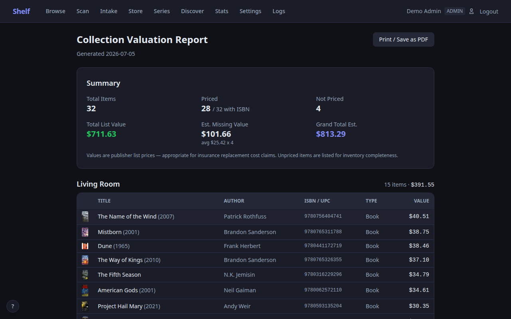
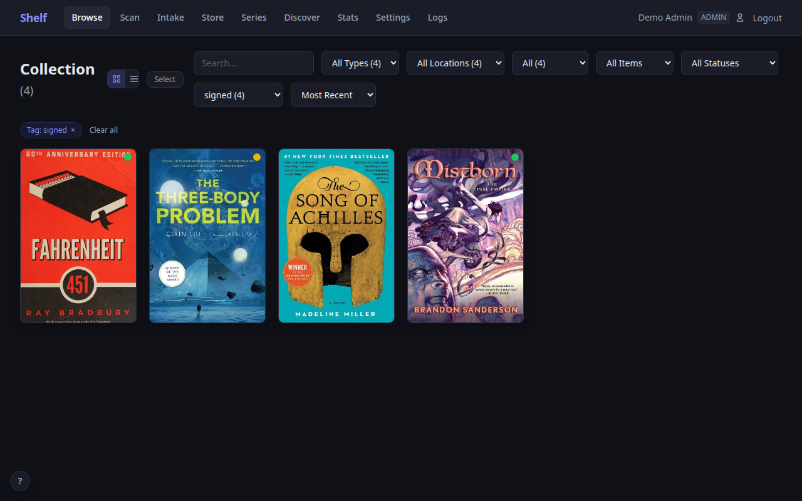
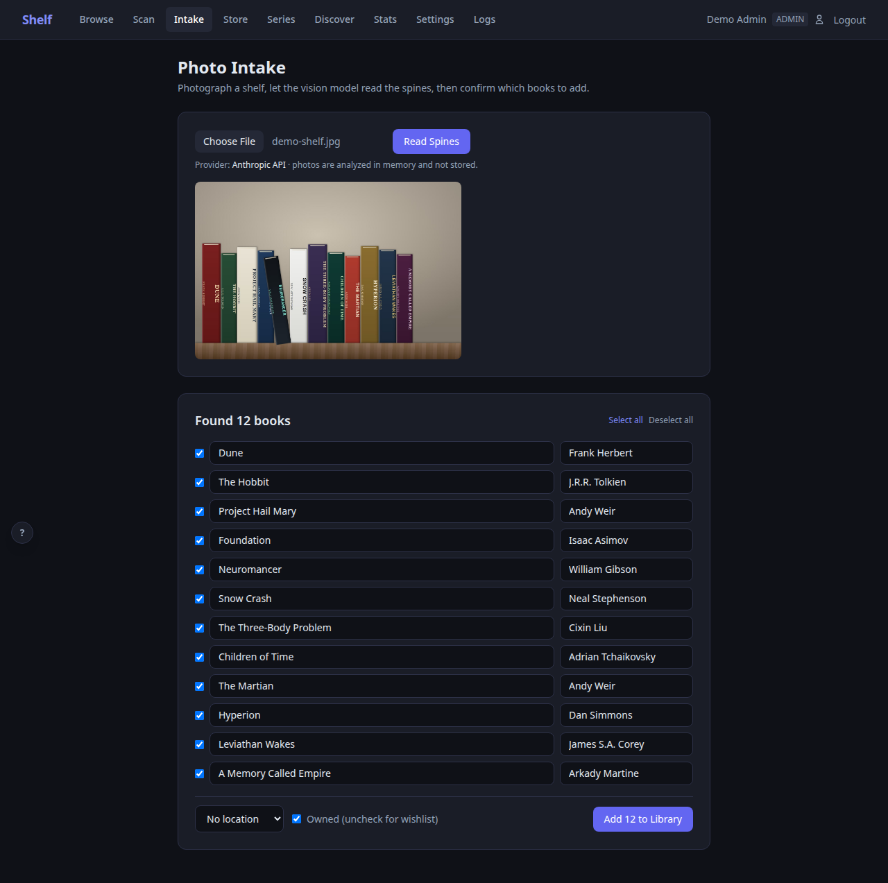

# Shelf

[](https://github.com/dgahagan/shelf/releases)
[](https://hub.docker.com/r/dgahagan/shelf)
[](https://github.com/dgahagan/shelf/actions/workflows/test.yml)
[](LICENSE)

A self-hosted home library catalog with barcode scanning, multi-mode scanning workflows, automatic metadata lookup, cover art, and collection management — all in a single Docker container.

<p align="center">
  
</p>

## Why Shelf?

Most home library apps are cloud-hosted, mobile-only, or require you to manually enter every book. Shelf takes a different approach:

- **Scan and done** — point your phone camera at a barcode or use a USB/Bluetooth barcode scanner and the book is cataloged in seconds, complete with cover art, author, series info, and description. Works out of the box with any scanner that sends Enter after the barcode (most do by default)
- **Bulk-add from a photo** — snap a picture of a full shelf and a vision model reads the spines. Review the detected titles, then import them all with full metadata and covers. Works with the Anthropic API or a fully local Ollama model
- **8 scan modes** — Add, Wishlist, Lend, Return, Move, Inventory, Lookup, and Quick Rate. The scan tab adapts to whatever you're doing: adding new items, lending to a friend, reorganizing shelves, or auditing a room
- **Title search** — don't have a barcode? Search by title across Open Library (books), TMDb (movies), and IGDB (video games) and add directly from results
- **Zero cloud dependency** — runs entirely on your network in a single Docker container with a SQLite database. Your data never leaves your home
- **Works on any device** — responsive web UI that works on phones, tablets, and desktops. No app store required
- **Multi-user** — share with your household. Admins manage the catalog, viewers can browse and track what they're reading
- **More than books** — catalog audiobooks, eBooks, DVDs, CDs, comics, kids' books, and video games. Link physical and digital formats together
- **Video game support** — scan UPC barcodes for modern games or search IGDB by title for retro cartridges (Atari 2600, NES, SNES, etc.). Cover art, publisher, series, and platform tracking with a customizable platform list
- **Lend with confidence** — track who borrowed what with the Lend/Return scan modes and a "Lent Out" filter on the browse page
- **Inventory auditing** — pick a location, scan everything on the shelf, then see what's missing
- **Know what you own** — ISBNdb integration estimates your collection's value and generates a location-grouped, print-ready valuation report for insurance documentation

## Screenshots

| Browse | Scan (Add Mode) |
|--------|-----------------|
|  |  |

| Scan (Lend Mode) | Item Detail |
|-------------------|-------------|
|  |  |

| Stats | Admin Logs |
|-------|------------|
|  |  |

| Valuation Report | Browse (Tag Filter) |
|------------------|---------------------|
|  |  |

| Photo Intake |
|--------------|
|  |

## Quick Start

```bash
docker compose up -d
```

Open `https://localhost:18888` and create your admin account via the setup wizard. That's it.

### Configuration

Create a `.env` file alongside `docker-compose.yml` for host-specific config:

```bash
# Add your machine's IP so you can access Shelf from other devices
CERT_SAN=IP:192.168.1.50,DNS:shelf,DNS:localhost
```

| Variable | Default | Description |
|----------|---------|-------------|
| `CERT_SAN` | `DNS:shelf,DNS:localhost` | TLS certificate Subject Alternative Names |
| `SECRET_KEY` | *(auto-generated)* | JWT signing key (auto-generated and stored in DB if not set) |
| `SHELF_ENCRYPTION_KEY` | *(auto-generated)* | Encryption key for stored API credentials. Auto-generated at `data/encryption.key` if not set — never stored in the DB, so backups contain ciphertext only. Set it (e.g. `openssl rand -hex 32`) so the data directory alone can't decrypt credentials |

### Data

All persistent data lives in `./data/` (bind-mounted into the container):

```
data/
  shelf.db        — SQLite database
  covers/         — cached cover images
  certs/          — auto-generated TLS certificates
  encryption.key  — key for credentials stored in the DB (unless
                    SHELF_ENCRYPTION_KEY is set); keep it out of shared copies
```

## Features

### Scanning and Metadata
- **Camera barcode scanning** on mobile — tap to scan ISBNs and UPCs
- **8 scan modes** — Add, Wishlist, Lend, Return, Move, Inventory, Lookup, and Quick Rate
- **Photo intake** — bulk-add books from a photo of your shelves using a vision model (see [Photo Intake](#photo-intake))
- **Title search** — search Open Library, TMDb, or IGDB by title when you don't have a barcode
- **Cascading metadata lookup** — Open Library, Hardcover, and Google Books
- **Cover art pipeline** — Open Library, Hardcover, Amazon, Google Books, IGDB, and manual upload/search
- **UPC support** — scan DVDs and Blu-rays with TMDb lookup
- **Video game support** — scan UPC barcodes for modern games or search IGDB by title for retro cartridges. Platform tracking with a customizable platform list (30+ platforms from Atari 2600 to PS5)

### Scan Modes

| Mode | What it does |
|------|-------------|
| **Add** | Scan barcodes to add items to your collection with full metadata lookup |
| **Wishlist** | Scan at a bookstore to save items you want — adds as unowned |
| **Lend** | Select a borrower, then scan items to check them out |
| **Return** | Scan items to check them back in |
| **Move** | Select a target location, then batch-scan items to relocate them |
| **Inventory** | Select a location, scan everything there, then check for missing items |
| **Lookup** | Scan to check if an item is in your collection — no changes made |
| **Quick Rate** | Scan to mark items as read/completed |

### Photo Intake

<p align="center">
  
</p>

Snap a photo of a shelf and Shelf reads the spines. Open **Photo Intake** in
the nav, upload the photo, and the detected books appear as an editable
candidate list — nothing is imported until you confirm. Confirmed rows run
through the normal metadata pipeline, so they arrive with full metadata and
cover art, and an author-match guard keeps wrong editions from slipping in.

Configure a vision backend under Settings → Integrations → Photo Intake:

- **Anthropic API** — best accuracy; pay-per-photo (typically a few cents)
- **Ollama** — free and fully local with any vision-capable model
  (gemma3, qwen2.5vl, llama3.2-vision, …); accuracy depends on the model

For high-resolution photos that exceed what the model actually ingests,
Shelf shows a preview of what the model will see and offers to split the
photo into overlapping tiles for better accuracy — with a cost estimate for
each option before anything is sent.

### Collection Management
- **Filter and search** — by media type, location, reading status, ownership, lending status, and free text
- **Reading tracking** — want-to-read, reading, and read with start/finish dates
- **Custom tags** — free-form tags (`signed`, `first-edition`, whatever you like) as chips on the item page, with a tag filter on Browse
- **Synopses** — item descriptions fetched automatically on add, plus a one-click backfill for your existing catalog (Open Library, Google Books, Hardcover)
- **Stats dashboard** — books read per year, collection growth, top authors, and value-over-time charts (server-rendered SVG, no JS)
- **Locations** — organize by room, shelf, or any system you like
- **Game platforms** — customizable list of platforms, add your own for niche or retro systems
- **Checkout system** — lend to borrowers with the Lend scan mode, filter by "Lent Out" in browse
- **Loan reminders** — overdue loans get a red badge, and an optional daily digest (ntfy or webhook) nags you about them; configure under Settings → Library → Lending
- **Wishlist** — mark items as unowned to build a wish list alongside your catalog
- **Series tracking** — a Series page groups your library by series with position numbers, flags likely gaps, and (with Hardcover configured) checks the full series and adds missing volumes to your wishlist in one click
- **Valuation report** — location-grouped, print-ready report of your collection's list-price value for insurance documentation ([print view](screenshots/valuation-report-print.png)); prices via ISBNdb
- **CSV import/export** — bulk operations and backups
- **Goodreads & StoryGraph migration** — upload your library export as-is; the format is auto-detected, reading statuses and owned/wishlist flags are mapped, and covers are fetched automatically
- **Store Mode (offline PWA)** — scan barcodes in a bookstore with no signal and get an instant Owned / On wishlist / Not in library verdict; unknown books queue on-device and are added to your wishlist automatically when you're back online (see [Store Mode](#store-mode-offline-pwa))

### Integrations
- **[Hardcover](https://hardcover.app)** — bidirectional reading status sync, import your library, discover new books
- **[Audiobookshelf](https://www.audiobookshelf.org)** — sync selected libraries from your Audiobookshelf server, link physical + digital formats, and jump straight to an item in ABS from its Shelf page
- **[IGDB](https://www.igdb.com)** — video game metadata, cover art, and platform info via Twitch developer credentials (free)
- **[ISBNdb](https://isbndb.com)** — collection valuation with list prices for insurance documentation

### Store Mode (Offline PWA)

Open **Store** in the nav (or visit `/store`), and Shelf caches your library's
ISBNs on the device. From then on, scanning a barcode answers instantly from
the local cache — even with zero signal in a bookstore basement. Books you
scan that aren't in your library are queued on-device and added to your
wishlist (with metadata and cover) the next time you're online.

To install it as an app, use your browser's "Add to Home Screen" while on the
store page. **One requirement:** service workers (the offline machinery) only
run on an origin your phone trusts. Options, from simplest to cleanest:

1. **Trust the self-signed cert on your phone** — download the cert from your
   Shelf server and install it (Android: Settings → Security → Install a
   certificate → CA certificate; iOS: install the profile, then enable full
   trust under Settings → General → About → Certificate Trust Settings).
2. **VPN home** (WireGuard/OpenVPN/Tailscale) — the offline cache still does
   the work in the store; the VPN is only needed when syncing.
3. **A real certificate** — reverse proxy with Let's Encrypt, or
   `tailscale cert` for a ts.net HTTPS name. Set `SHELF_TRUST_PROXY=1` if a
   proxy sits in front.

Note that `localhost` is always trusted, so store mode works out of the box
for local development.

### Sharing

Create public read-only links under Settings → Data → Sharing — a **wishlist
link** for gift ideas or a **collection link** for browsing. Anyone with the
URL sees titles, authors, covers, and series only (never locations, loans,
values, notes, or ISBNs). Links are unguessable 128-bit tokens, rate-limited,
marked `noindex`, and revocable at any time.

### Administration
- **Role-based access** — admin, editor, and viewer roles
- **Web log viewer** — monitor auth events, sync activity, and errors from the browser
- **HTTPS** — self-signed TLS certificates generated on first run
- **Backup/restore** — database backup and restore from the settings page, with optional passphrase-encrypted (AES) backup downloads that are safe to store off-site
- **Hardened by default** — strict Content-Security-Policy (no `unsafe-inline`/`unsafe-eval`, no CDNs), CSRF protection on all mutating requests, write-only API credentials in Settings, encrypted credential storage

## Tech Stack

| Layer | Technology |
|-------|-----------|
| Backend | Python 3.12, FastAPI, SQLite (WAL mode) |
| Frontend | Jinja2, HTMX, Alpine.js, Tailwind CSS |
| Auth | bcrypt, JWT in HTTP-only secure cookies |
| Container | Docker, non-root user, self-signed HTTPS |

## Roles

| Role | Can do |
|------|--------|
| **Admin** | Everything: settings, users, locations, sync, bulk ops, logs |
| **Editor** | Add/edit/delete items, scan (all modes), manage covers, checkout/checkin, import/export |
| **Viewer** | Browse, search, reading status, export CSV, view stats |

## Metadata Sources

Shelf queries free, public APIs to look up book and game information — no API keys needed for core book functionality:

| Source | What it provides | API key required? |
|--------|-----------------|-------------------|
| [Open Library](https://openlibrary.org) | Title, author, description, cover art, publish info, title search | No |
| [Google Books](https://books.google.com) | Fallback metadata and cover art | No |
| [Amazon Images](https://www.amazon.com) | Fallback cover art via ISBN | No |
| [UPC Item DB](https://www.upcitemdb.com) | Title lookup from UPC barcodes (games, DVDs) | No |

Metadata lookups send only the ISBN or UPC to these services. No personal data, account info, or collection details are transmitted.

## Optional API Keys

Configure in Settings to unlock additional features:

| Service | Enables | Link |
|---------|---------|------|
| **Hardcover** | Reading status sync, richer metadata, import/export, Discover page | [hardcover.app](https://hardcover.app) |
| **IGDB** (Twitch) | Video game metadata, cover art, and platform info | [dev.twitch.tv/console](https://dev.twitch.tv/console) |
| **ISBNdb** | Collection valuation with market prices | [isbndb.com](https://isbndb.com) |
| **TMDb** | DVD/Blu-ray metadata and title search via UPC barcode | [themoviedb.org](https://www.themoviedb.org) |
| **Anthropic** | Photo Intake spine recognition (or use a local Ollama model — no key needed) | [console.anthropic.com](https://console.anthropic.com) |

## Development

```bash
# Rebuild after code changes
docker compose build && docker compose up -d

# View logs
docker compose logs -f shelf

# Access the database
sqlite3 data/shelf.db

# Rebuild the Tailwind stylesheet after changing templates or static/js
# (all JS/CSS is vendored locally — no CDNs; requires node/npx)
make css
```

### QA Pipeline

Shelf ships with a `Makefile` that orchestrates a two-pass local QA workflow — no CI/CD required.

**One-time setup:**

```bash
pip install -r requirements-dev.txt
make install-playwright   # downloads headless Chromium
```

**Common targets:**

| Target | What it does |
|--------|-------------|
| `make test` | Unit and integration tests (pytest, excludes E2E) |
| `make test-e2e` | Playwright E2E browser tests against a live local server |
| `make test-all` | Both of the above |
| `make check-deps` | `pip-audit` vulnerability scan of `requirements.txt` |
| `make check-licenses` | License compliance report |
| `make check-secrets` | Scan tracked files for accidentally hardcoded secrets |
| `make check-csrf` | Lint that raw `fetch()` calls send the CSRF token |
| `make check-alpine` | Verify templates stay compatible with the Alpine CSP build |
| `make checks` | All of the checks above |
| `make report-review` | Code review report via Claude agent |
| `make report-security` | Security audit report via Claude agent |
| `make report-test` | Test coverage audit report via Claude agent |
| `make reports` | All three reports |
| `make qa` | Full Pass 1: `test-all` → `checks` → `reports` |
| `make fix` | Pass 2a: interactive Claude session reads reports and applies fixes |
| `make verify` | Pass 2b: re-run all tests after fixes |
| `make release-check` | Alias for `make qa` |
| `make install-hooks` | Install a pre-push git hook that runs `make test-all` |

**Typical pre-release workflow:**

```bash
make qa          # run tests, checks, and generate reports
# review docs/CODE_REVIEW_*.md, SECURITY_AUDIT_*.md, TEST_AUDIT_*.md
make fix         # Claude reads reports and applies fixes interactively
make verify      # confirm all tests still pass
```

Reports land in `docs/` with today's date (e.g. `docs/CODE_REVIEW_2026-03-27.md`) and are gitignored — they're regenerated each QA cycle.

Report targets default to `claude-sonnet-4-6`. Override with `MODEL=` for a deeper pre-release audit:

```bash
make reports MODEL=claude-opus-4-6
```

## License

[AGPL-3.0](LICENSE) — free to use, self-host, and modify. If you offer a
modified version of Shelf as a network service, you must make your changes
available under the same license.
